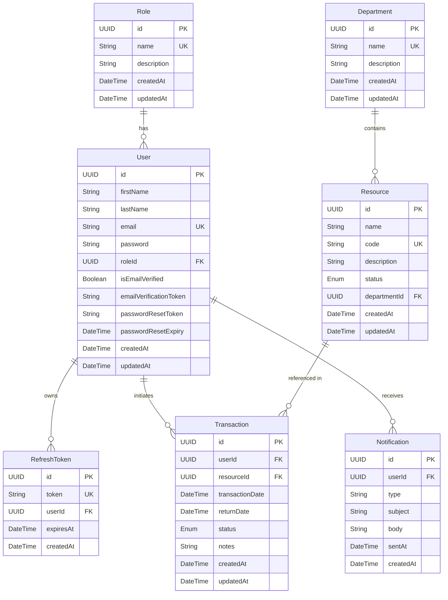
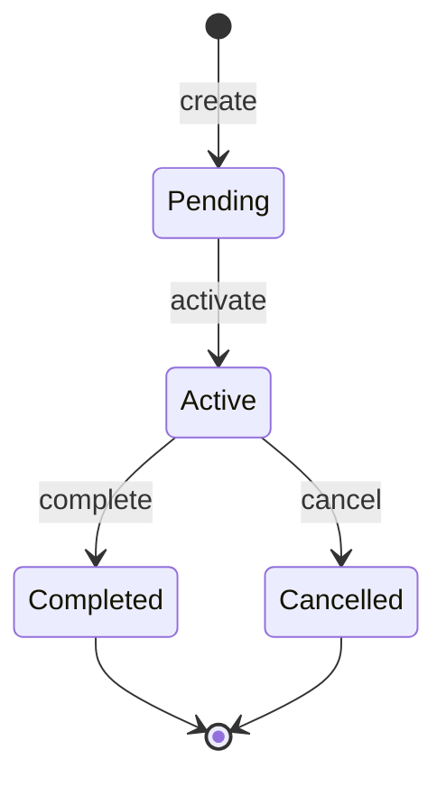

# Design Document

## Institution Management Starter Kit

---

## Overview

The Institution Management Starter Kit is a production-ready REST API backend scaffold built with Node.js, TypeScript, and Express.js. Its primary purpose is to provide a clean, modular foundation that developers can rapidly adapt into domain-specific management systems — such as a Library Management System, School Management System, Inventory System, or any similar institution-oriented application.

The system is intentionally generic: its core entities (Department, Resource, Transaction) are named to be domain-neutral and can be renamed or extended without restructuring the codebase. The architecture enforces a strict layered pattern (Controller → Service → Repository → Prisma) within a feature-based module structure, ensuring each concern is isolated and independently testable.

Key capabilities shipped out of the box:
- JWT authentication with access/refresh token rotation
- Role-based access control (RBAC) via middleware
- Full CRUD for Users, Roles, Departments, Resources, and Transactions
- Transactional email via Brevo with HTML templates
- Aggregated reports and a dashboard endpoint
- Zod request validation, global error handling, and standard response envelopes
- Swagger/OpenAPI interactive documentation
- Jest + Supertest test suite with property-based correctness properties
- Docker Compose for one-command local setup

---

## Architecture

### Layered Request Flow

Every HTTP request passes through the following layers in order:

```
Client
  │
  ▼
Express Router
  │
  ▼
Middleware Stack
  ├── authenticate (JWT verification)
  ├── authorise(...roles) (RBAC check)
  └── validate(zodSchema) (Zod validation)
  │
  ▼
Controller
  │  (parses req, calls service, sends res)
  ▼
Service
  │  (business logic, orchestrates repositories)
  ▼
Repository
  │  (Prisma queries, data access only)
  ▼
Prisma ORM
  │
  ▼
PostgreSQL
```

Errors at any layer are passed to `next(error)` and caught by the Global Error Handler, which is registered as the last Express middleware.

### Module Structure

```
src/
├── config/
│   ├── env.ts              # Env var validation (Zod)
│   ├── database.ts         # Prisma client singleton
│   └── swagger.ts          # swagger-jsdoc options
├── modules/
│   ├── auth/
│   │   ├── controller/
│   │   ├── service/
│   │   ├── repository/
│   │   ├── routes/
│   │   ├── dto/
│   │   ├── validation/
│   │   ├── types/
│   │   └── tests/
│   ├── users/
│   ├── roles/
│   ├── departments/
│   ├── resources/
│   ├── transactions/
│   ├── notifications/
│   ├── reports/
│   └── dashboard/
├── middleware/
│   ├── authenticate.ts
│   ├── authorise.ts
│   ├── validate.ts
│   └── errorHandler.ts
├── utils/
│   ├── AppError.ts
│   ├── asyncHandler.ts
│   ├── pagination.ts
│   └── response.ts
├── shared/
│   └── zod/
│       └── common.schemas.ts
├── database/
│   └── seed.ts
├── docs/
│   └── er-diagram.md
├── routes/
│   └── index.ts
├── app.ts
└── server.ts
```

### Technology Stack

| Concern | Choice | Rationale |
|---|---|---|
| Runtime | Node.js 20 LTS | LTS stability, broad ecosystem |
| Language | TypeScript 5 (strict) | Type safety, IDE support |
| Framework | Express.js 4 | Minimal, well-understood, large middleware ecosystem |
| ORM | Prisma 5 | Type-safe queries, migration tooling, schema-first |
| Database | PostgreSQL 15 | Relational integrity, UUID support, JSON fields |
| Auth | jsonwebtoken + bcrypt | Industry-standard JWT; bcrypt for password hashing |
| Validation | Zod | Runtime schema validation with TypeScript inference |
| Email | @getbrevo/brevo SDK | Official Brevo SDK, fire-and-forget pattern |
| Docs | swagger-jsdoc + swagger-ui-express | JSDoc-annotated OpenAPI generation |
| Testing | Jest + ts-jest + Supertest | First-class TS support; HTTP integration testing |
| Containerisation | Docker + Docker Compose | Reproducible local environment |
| Linting/Formatting | ESLint + Prettier | Consistent code style |

---

## Components and Interfaces

### Middleware

#### `authenticate` Middleware

Extracts the Bearer token from the `Authorization` header, verifies it with `jsonwebtoken`, and attaches the decoded payload to `req.user`. Returns `401` if the header is absent, malformed, or the token is expired/invalid.

```typescript
interface JwtPayload {
  userId: string;
  email: string;
  role: string;
}

// Attached to req after successful verification
declare global {
  namespace Express {
    interface Request {
      user?: JwtPayload;
    }
  }
}
```

#### `authorise(...roles)` Middleware Factory

Returns an Express middleware that checks `req.user.role` against the provided roles list. Returns `403` if the role is not permitted.

```typescript
const authorise = (...roles: string[]) => RequestHandler;
```

#### `validate(schema)` Middleware Factory

Accepts a Zod schema and validates `req.body`, `req.params`, and/or `req.query`. On failure, formats Zod errors into the standard error envelope and returns `400`.

```typescript
const validate = (schema: ZodSchema) => RequestHandler;
```

#### Global Error Handler

Registered as the last `app.use()` call. Handles `AppError`, Prisma `P2002`/`P2025` errors, and all other unhandled errors.

```typescript
const errorHandler: ErrorRequestHandler = (err, req, res, next) => { ... };
```

### Utility Classes

#### `AppError`

```typescript
class AppError extends Error {
  statusCode: number;
  errors?: Record<string, string>[];
  constructor(message: string, statusCode: number, errors?: Record<string, string>[]);
}
```

#### `asyncHandler`

Wraps async route handlers to forward rejected promises to `next(error)`, eliminating try/catch boilerplate in controllers.

```typescript
const asyncHandler = (fn: AsyncRequestHandler) => RequestHandler;
```

#### Response Helpers

```typescript
// Success envelope
const sendSuccess = (res: Response, data: unknown, message: string, statusCode = 200) => void;

// Error envelope (used by error handler)
const sendError = (res: Response, message: string, statusCode: number, errors?: unknown[]) => void;
```

#### Pagination Helper

```typescript
interface PaginationParams {
  page: number;
  limit: number;
}

interface PaginatedResult<T> {
  data: T[];
  page: number;
  limit: number;
  total: number;
  totalPages: number;
}

const paginate = (params: PaginationParams) => { skip: number; take: number };
const buildPaginatedResult = <T>(data: T[], total: number, params: PaginationParams) => PaginatedResult<T>;
```

### Auth Module

#### Auth Service Interface

```typescript
interface AuthService {
  register(dto: RegisterDto): Promise<UserPublic>;
  verifyEmail(token: string): Promise<void>;
  login(dto: LoginDto): Promise<{ accessToken: string; refreshToken: string }>;
  logout(refreshToken: string): Promise<void>;
  forgotPassword(email: string): Promise<void>;
  resetPassword(token: string, newPassword: string): Promise<void>;
  refreshToken(token: string): Promise<{ accessToken: string }>;
}
```

#### Token Strategy

- **Access Token**: JWT signed with `JWT_SECRET`, payload `{ userId, email, role }`, expiry from `JWT_ACCESS_EXPIRY` (default `15m`).
- **Refresh Token**: Cryptographically random UUID stored in the `RefreshToken` table, expiry from `JWT_REFRESH_EXPIRY` (default `7d`). On logout or rotation, the record is deleted.

### CRUD Module Pattern

All CRUD modules (Users, Roles, Departments, Resources, Transactions) follow the same interface pattern:

```typescript
// Repository interface (example: DepartmentRepository)
interface DepartmentRepository {
  findAll(params: FindAllParams): Promise<[Department[], number]>;
  findById(id: string): Promise<Department | null>;
  create(data: CreateDepartmentDto): Promise<Department>;
  update(id: string, data: UpdateDepartmentDto): Promise<Department>;
  delete(id: string): Promise<void>;
}

// Service interface
interface DepartmentService {
  getAll(query: DepartmentQueryDto): Promise<PaginatedResult<Department>>;
  getById(id: string): Promise<Department>;
  create(dto: CreateDepartmentDto): Promise<Department>;
  update(id: string, dto: UpdateDepartmentDto): Promise<Department>;
  delete(id: string): Promise<void>;
}
```

### Notification Module

The notification module is fire-and-forget: it never blocks the primary request flow.

```typescript
interface NotificationService {
  sendWelcomeEmail(user: UserPublic, verificationToken: string): Promise<void>;
  sendVerificationSuccessEmail(user: UserPublic): Promise<void>;
  sendPasswordResetEmail(user: UserPublic, resetToken: string): Promise<void>;
  sendTransactionCreatedEmail(user: UserPublic, transaction: Transaction): Promise<void>;
  sendTransactionStatusUpdateEmail(user: UserPublic, transaction: Transaction): Promise<void>;
}
```

Each method:
1. Renders the HTML template with dynamic placeholders
2. Calls the Brevo SDK `sendTransactionalEmail`
3. Persists a `Notification` record in the database
4. On Brevo error: logs the error (recipient + type), does NOT rethrow

### Reports Module

```typescript
interface ReportsService {
  getUserReport(): Promise<UserReport>;
  getResourceReport(): Promise<ResourceReport>;
  getTransactionReport(): Promise<TransactionReport>;
  getDepartmentReport(): Promise<DepartmentReport>;
}

interface UserReport {
  totalUsers: number;
  byRole: { role: string; count: number }[];
  recentUsers: UserPublic[];  // up to 10
}
```

### Dashboard Module

```typescript
interface DashboardService {
  getSummary(): Promise<DashboardSummary>;
}

interface DashboardSummary {
  totalUsers: number;
  totalResources: number;
  totalTransactions: number;
  totalDepartments: number;
  recentTransactions: TransactionWithRelations[];  // last 5
  recentUsers: UserPublic[];                        // last 5
  departmentStats: { department: string; resourceCount: number }[];
}
```

---

## Data Models

### Entity Relationship Diagram



### Prisma Schema (abbreviated)

```prisma
model User {
  id                     String    @id @default(uuid())
  firstName              String
  lastName               String
  email                  String    @unique
  password               String
  roleId                 String
  isEmailVerified        Boolean   @default(false)
  emailVerificationToken String?
  passwordResetToken     String?
  passwordResetExpiry    DateTime?
  createdAt              DateTime  @default(now())
  updatedAt              DateTime  @updatedAt

  role          Role           @relation(fields: [roleId], references: [id])
  refreshTokens RefreshToken[]
  transactions  Transaction[]
  notifications Notification[]

  @@index([email])
}

model RefreshToken {
  id        String   @id @default(uuid())
  token     String   @unique
  userId    String
  expiresAt DateTime
  createdAt DateTime @default(now())

  user User @relation(fields: [userId], references: [id], onDelete: Cascade)
}

model Resource {
  id           String           @id @default(uuid())
  name         String
  code         String           @unique
  description  String?
  status       ResourceStatus   @default(Active)
  departmentId String
  createdAt    DateTime         @default(now())
  updatedAt    DateTime         @updatedAt

  department   Department    @relation(fields: [departmentId], references: [id])
  transactions Transaction[]

  @@index([code])
  @@index([departmentId])
}

model Transaction {
  id              String            @id @default(uuid())
  userId          String
  resourceId      String
  transactionDate DateTime
  returnDate      DateTime?
  status          TransactionStatus @default(Pending)
  notes           String?
  createdAt       DateTime          @default(now())
  updatedAt       DateTime          @updatedAt

  user     User     @relation(fields: [userId], references: [id])
  resource Resource @relation(fields: [resourceId], references: [id])

  @@index([userId])
  @@index([resourceId])
  @@index([status])
}

enum ResourceStatus {
  Active
  Inactive
}

enum TransactionStatus {
  Pending
  Active
  Completed
  Cancelled
}
```

### Transaction Status State Machine



Valid transitions:
- `Pending → Active`
- `Active → Completed`
- `Active → Cancelled`
- `Completed` and `Cancelled` are terminal states

### DTO Shapes

```typescript
// Auth DTOs
interface RegisterDto {
  firstName: string;
  lastName: string;
  email: string;
  password: string;  // min 8 chars
}

interface LoginDto {
  email: string;
  password: string;
}

// Pagination query (shared)
interface PaginationQuery {
  page?: number;   // default 1
  limit?: number;  // default 10
  search?: string;
}

// Resource query (extends pagination)
interface ResourceQuery extends PaginationQuery {
  departmentId?: string;
  status?: 'Active' | 'Inactive';
  sortBy?: 'name' | 'code' | 'createdAt';
  sortOrder?: 'asc' | 'desc';
}

// Transaction query
interface TransactionQuery extends PaginationQuery {
  userId?: string;
  resourceId?: string;
  status?: TransactionStatus;
}

// Public user shape (password excluded)
interface UserPublic {
  id: string;
  firstName: string;
  lastName: string;
  email: string;
  roleId: string;
  isEmailVerified: boolean;
  createdAt: Date;
  updatedAt: Date;
}
```

---

## Correctness Properties

*A property is a characteristic or behavior that should hold true across all valid executions of a system — essentially, a formal statement about what the system should do. Properties serve as the bridge between human-readable specifications and machine-verifiable correctness guarantees.*

---

### Property 1: Password Hashing Irreversibility and Verifiability

*For any* plaintext password string, the value stored in the database SHALL NOT equal the plaintext, and `bcrypt.compare(plaintext, stored)` SHALL return `true`.

**Validates: Requirements 3.13**

---

### Property 2: Registration Round-Trip

*For any* valid registration payload (unique email, valid firstName, lastName, password), submitting a `POST /api/v1/auth/register` request SHALL return a `201` response whose `data` object contains the same `email`, `firstName`, and `lastName` as the input, and the `password` field SHALL be absent from the response.

**Validates: Requirements 3.1, 4.5**

---

### Property 3: Duplicate Email Rejection

*For any* email address that is already registered in the system, attempting to register again with that email SHALL return a `409` response.

**Validates: Requirements 3.2, 5.5, 6.6, 7.9**

---

### Property 4: Email Verification Round-Trip

*For any* registered user who has not yet verified their email, submitting the correct `emailVerificationToken` to `POST /api/v1/auth/verify-email` SHALL set `isEmailVerified` to `true` on the user record, and subsequently submitting the same token again SHALL return a `400` response (token already consumed).

**Validates: Requirements 3.3, 3.4**

---

### Property 5: Login Produces Valid Tokens

*For any* registered and email-verified user, submitting correct credentials to `POST /api/v1/auth/login` SHALL return a `200` response containing a non-empty `accessToken` and a non-empty `refreshToken`, both of which are valid JWT or token strings.

**Validates: Requirements 3.5, 3.14**

---

### Property 6: Invalid Credentials Rejection

*For any* registered user, submitting an incorrect password to `POST /api/v1/auth/login` SHALL return a `401` response. *For any* email address that is not registered, submitting any password SHALL also return a `401` response.

**Validates: Requirements 3.6**

---

### Property 7: Refresh Token Invalidation After Logout

*For any* valid refresh token obtained via login, after submitting it to `POST /api/v1/auth/logout`, submitting the same token to `POST /api/v1/auth/refresh-token` SHALL return a non-`200` response (the token has been invalidated).

**Validates: Requirements 3.7**

---

### Property 8: Password Reset Round-Trip

*For any* registered user, after requesting a password reset and receiving a valid reset token, submitting that token with a new password to `POST /api/v1/auth/reset-password` SHALL allow the user to log in with the new password and SHALL prevent login with the old password.

**Validates: Requirements 3.10**

---

### Property 9: Invalid Token Rejection

*For any* string that is not a currently valid verification or reset token (e.g., random UUID, expired token, empty string), submitting it to `POST /api/v1/auth/verify-email` or `POST /api/v1/auth/reset-password` SHALL return a `400` response.

**Validates: Requirements 3.4, 3.11**

---

### Property 10: Pagination Correctness

*For any* paginated endpoint called with valid `page` (≥ 1) and `limit` (≥ 1) parameters, the response SHALL satisfy all of the following simultaneously:
- `data.length` ≤ `limit`
- `totalPages` = ⌈`total` / `limit`⌉
- `page` in the response equals the requested `page`
- `limit` in the response equals the requested `limit`
- If `page` > `totalPages` and `total` > 0, `data` SHALL be an empty array

**Validates: Requirements 4.1, 6.1, 7.1, 8.1, 12.5**

---

### Property 11: Search Filter Completeness

*For any* search query string submitted to a searchable endpoint (`/users`, `/departments`, `/resources`), every item in the returned `data` array SHALL contain the search term (case-insensitive) in at least one of the designated searchable fields, and no item that matches the search term in those fields SHALL be omitted from the result set.

**Validates: Requirements 4.2, 6.2, 7.2**

---

### Property 12: Field Filter Exactness

*For any* filter parameter submitted to a filterable endpoint (e.g., `departmentId` on `/resources`, `status` on `/resources` or `/transactions`, `userId` or `resourceId` on `/transactions`), every item in the returned `data` array SHALL have a field value exactly equal to the filter value, and no item with a different value for that field SHALL appear in the results.

**Validates: Requirements 7.3, 7.4, 8.2, 8.3, 8.4**

---

### Property 13: Sort Order Correctness

*For any* `sortBy` field and `sortOrder` direction (`asc` or `desc`) submitted to `/api/v1/resources`, the returned `data` array SHALL be ordered such that for every adjacent pair of items `(a, b)`, `a[sortBy]` ≤ `b[sortBy]` when `sortOrder` is `asc`, and `a[sortBy]` ≥ `b[sortBy]` when `sortOrder` is `desc`.

**Validates: Requirements 7.5**

---

### Property 14: Valid Transaction Status Transitions

*For any* transaction in a given status, a `PUT` request to update the status SHALL succeed (`200`) if and only if the transition is in the set `{Pending→Active, Active→Completed, Active→Cancelled}`. All other transitions (including `Completed→*`, `Cancelled→*`, and any same-status update) SHALL return a `400` response.

**Validates: Requirements 8.10**

---

### Property 15: CRUD Round-Trip Consistency

*For any* entity (User, Role, Department, Resource, Transaction) created via a `POST` request, a subsequent `GET /:id` request using the returned `id` SHALL return a response whose `data` fields match the values submitted in the creation request (excluding server-generated fields such as `id`, `createdAt`, `updatedAt`).

**Validates: Requirements 4.3, 4.5, 4.6, 5.2, 5.4, 6.3, 6.5, 7.6, 7.8, 8.5, 8.7**

---

### Property 16: Delete Then Not-Found

*For any* entity that has been successfully deleted via a `DELETE /:id` request, a subsequent `GET /:id` request for the same `id` SHALL return a `404` response.

**Validates: Requirements 4.7, 5.7, 6.8, 7.12, 8.11**

---

### Property 17: Referential Integrity Conflict on Delete

*For any* parent entity (Role, Department, Resource) that has one or more dependent child records (Users for Role, Resources for Department, Transactions for Resource), a `DELETE` request for that parent SHALL return a `409` response and the parent record SHALL remain in the database.

**Validates: Requirements 5.8, 6.9, 7.13**

---

### Property 18: Standard Response Envelope

*For any* API request that returns a `2xx` status code, the response body SHALL be a JSON object with `success: true`, a non-empty `message` string, and a `data` field. *For any* API request that returns a non-`2xx` status code, the response body SHALL be a JSON object with `success: false`, a non-empty `message` string, and an `errors` array.

**Validates: Requirements 12.2, 12.3, 12.4**

---

### Property 19: Authentication Enforcement

*For any* protected endpoint (all endpoints except the five public auth routes), a request submitted without an `Authorization` header, or with an invalid or expired Bearer token, SHALL return a `401` response regardless of the request body or query parameters.

**Validates: Requirements 4.8, 15.1, 15.2, 15.5**

---

### Property 20: Role-Based Access Control Enforcement

*For any* endpoint that requires a specific role (e.g., Admin-only endpoints), a request submitted with a valid Access Token belonging to a user whose role is not in the permitted roles list SHALL return a `403` response.

**Validates: Requirements 4.9, 5.1, 8.7, 10.5, 11.2, 15.3, 15.4**

---

### Property 21: Validation Error Field Reporting

*For any* request body that fails Zod schema validation, the `400` response SHALL include an `errors` array where each element identifies the specific field that failed validation and provides a human-readable error message for that field.

**Validates: Requirements 13.1, 13.2**

---

### Property 22: Error Handler Status Code Preservation

*For any* `AppError` thrown with a given `statusCode`, the Global Error Handler SHALL return an HTTP response with exactly that `statusCode`. *For any* Prisma `P2002` error, the response SHALL be `409`. *For any* Prisma `P2025` error, the response SHALL be `404`.

**Validates: Requirements 14.3, 14.4, 14.5**

---

### Property 23: Notification Record Persistence

*For any* event that triggers an outbound email (registration, email verification, password reset, transaction creation, transaction status update), a `Notification` record SHALL be created in the database with the correct `type`, `subject`, `body`, and `userId` fields, regardless of whether the Brevo API call succeeds or fails.

**Validates: Requirements 9.1, 9.2, 9.3, 9.4, 9.5, 9.8**

---

### Property 24: Email Template Placeholder Substitution

*For any* email template and corresponding data object, rendering the template SHALL produce an HTML string that contains the resolved values of all dynamic placeholders (e.g., `{{firstName}}` replaced with the actual first name) and SHALL NOT contain any unresolved placeholder tokens.

**Validates: Requirements 9.6**

---

### Property 25: Report Totals Consistency

*For any* database state, the `total` counts returned by the report endpoints (`/reports/users`, `/reports/resources`, `/reports/transactions`, `/reports/departments`) and the dashboard endpoint (`/dashboard`) SHALL equal the actual count of records in the corresponding database tables at the time of the request.

**Validates: Requirements 10.1, 10.2, 10.3, 10.4, 11.1**

---

### Property 26: Seeder Idempotency

*For any* database state where the minimum required seed records already exist, running the seeder again SHALL NOT create duplicate records, and the final record count SHALL equal the count before the second seeder run.

**Validates: Requirements 2.9, 2.10**

---

## Error Handling

### AppError Class

All anticipated business logic errors are thrown as `AppError` instances. This gives the Global Error Handler a typed, predictable error shape to work with.

```typescript
class AppError extends Error {
  public readonly statusCode: number;
  public readonly errors?: { field: string; message: string }[];
  public readonly isOperational: boolean = true;

  constructor(
    message: string,
    statusCode: number,
    errors?: { field: string; message: string }[]
  ) {
    super(message);
    this.statusCode = statusCode;
    this.errors = errors;
    Error.captureStackTrace(this, this.constructor);
  }
}
```

### Global Error Handler

The error handler is the last `app.use()` call and handles four categories of errors:

| Error Type | Detection | HTTP Status | Response |
|---|---|---|---|
| `AppError` | `err instanceof AppError` | `err.statusCode` | `err.message` + `err.errors` |
| Prisma P2002 (unique constraint) | `err.code === 'P2002'` | `409` | Human-readable conflict message |
| Prisma P2025 (record not found) | `err.code === 'P2025'` | `404` | Human-readable not-found message |
| All other errors | fallback | `500` | Generic message; full stack logged |

```typescript
const errorHandler: ErrorRequestHandler = (err, req, res, next) => {
  if (err instanceof AppError) {
    return sendError(res, err.message, err.statusCode, err.errors);
  }

  if (err?.code === 'P2002') {
    return sendError(res, 'A record with this value already exists.', 409);
  }

  if (err?.code === 'P2025') {
    return sendError(res, 'The requested record was not found.', 404);
  }

  // Log full stack for unexpected errors
  console.error('[UnhandledError]', err);
  return sendError(res, 'An unexpected error occurred.', 500);
};
```

### 404 Catch-All Route

Registered after all route definitions but before the error handler:

```typescript
app.use('*', (req, res) => {
  sendError(res, `Route ${req.originalUrl} not found.`, 404);
});
```

### Notification Error Isolation

Email sending is wrapped in a try/catch that logs but never rethrows:

```typescript
async function sendEmail(params: EmailParams): Promise<void> {
  try {
    await brevoClient.sendTransactionalEmail(params);
  } catch (error) {
    console.error('[NotificationError]', {
      recipient: params.to[0].email,
      type: params.subject,
      error,
    });
    // Do NOT rethrow — primary request flow must not be disrupted
  }
}
```

### asyncHandler Wrapper

Eliminates try/catch boilerplate in every controller:

```typescript
const asyncHandler =
  (fn: (req: Request, res: Response, next: NextFunction) => Promise<void>) =>
  (req: Request, res: Response, next: NextFunction) => {
    Promise.resolve(fn(req, res, next)).catch(next);
  };
```

---

## Testing Strategy

### Overview

The testing strategy uses a dual approach: **example-based integration tests** for concrete scenarios and **property-based tests** for universal correctness guarantees. Both are complementary — integration tests catch specific regressions, property tests verify general invariants across a wide input space.

### Test Runner Configuration

- **Framework**: Jest with `ts-jest` for TypeScript support
- **HTTP testing**: Supertest against the Express app instance (no live server needed)
- **Property-based testing**: `fast-check` library (TypeScript-native, no separate process)
- **Coverage**: Collected from `src/` directory, reported on `npm run test`
- **Config file**: `jest.config.ts`

```typescript
// jest.config.ts
export default {
  preset: 'ts-jest',
  testEnvironment: 'node',
  roots: ['<rootDir>/src'],
  collectCoverageFrom: ['src/**/*.ts', '!src/**/*.d.ts'],
  coverageDirectory: 'coverage',
  testMatch: ['**/*.test.ts', '**/*.spec.ts'],
};
```

### Property-Based Test Configuration

- **Library**: `fast-check` (`npm install --save-dev fast-check`)
- **Minimum iterations**: 100 per property test (`numRuns: 100`)
- **Tag format**: Each property test includes a comment: `// Feature: institution-management-starter-kit, Property N: <property_text>`
- **Mocking**: Prisma client is mocked via `jest.mock` for unit-level property tests; integration property tests use a test database

```typescript
// Example property test structure
import fc from 'fast-check';

describe('Property 2: Registration Round-Trip', () => {
  it('should return 201 with matching public fields for any valid payload', async () => {
    // Feature: institution-management-starter-kit, Property 2: Registration Round-Trip
    await fc.assert(
      fc.asyncProperty(
        fc.record({
          firstName: fc.string({ minLength: 1, maxLength: 50 }),
          lastName: fc.string({ minLength: 1, maxLength: 50 }),
          email: fc.emailAddress(),
          password: fc.string({ minLength: 8, maxLength: 100 }),
        }),
        async (payload) => {
          const res = await request(app).post('/api/v1/auth/register').send(payload);
          expect(res.status).toBe(201);
          expect(res.body.data.email).toBe(payload.email);
          expect(res.body.data.password).toBeUndefined();
        }
      ),
      { numRuns: 100 }
    );
  });
});
```

### Test Organisation

Tests live inside each module's `tests/` directory:

```
src/modules/auth/tests/
  ├── auth.service.unit.test.ts      # Unit tests with mocked repository
  ├── auth.integration.test.ts       # Supertest integration tests
  └── auth.property.test.ts          # fast-check property tests

src/modules/users/tests/
  ├── users.integration.test.ts
  └── users.property.test.ts

src/modules/transactions/tests/
  ├── transactions.integration.test.ts
  └── transactions.property.test.ts
```

### Unit Tests (Auth Service)

Cover the following scenarios with mocked repositories:
- Successful registration (happy path)
- Duplicate email rejection → `AppError(409)`
- Successful login → returns token pair
- Invalid credentials → `AppError(401)`
- Password reset flow (request → reset → login with new password)
- Email verification flow (verify → `isEmailVerified: true`)

### Integration Tests

Each module has integration tests using Supertest against a test database (separate `TEST_DATABASE_URL`):

| Module | Scenarios |
|---|---|
| Auth | Register, login, logout, verify-email, forgot-password, reset-password, refresh-token |
| Users | List with pagination, search, get by ID (found/not found), create, update, delete, 401/403 enforcement |
| Roles | List, get by ID, create, duplicate name conflict, update, delete, delete-with-users conflict |
| Departments | List, search, create, update, delete, delete-with-resources conflict |
| Resources | List with pagination, filter by department/status, sort, create, update, delete, delete-with-transactions conflict |
| Transactions | List with filter by user/resource/status, create, update status (valid/invalid transitions), delete |
| Reports | All four report endpoints, 403 for non-Admin |
| Dashboard | Summary endpoint, 403 for non-Admin |

### Property-Based Tests

Each correctness property from the design document maps to one property-based test:

| Property | Test File | fast-check Arbitraries |
|---|---|---|
| P1: Password Hashing | `auth.property.test.ts` | `fc.string()` for passwords |
| P2: Registration Round-Trip | `auth.property.test.ts` | `fc.record({ firstName, lastName, email, password })` |
| P3: Duplicate Email Rejection | `auth.property.test.ts` | `fc.emailAddress()` |
| P4: Email Verification Round-Trip | `auth.property.test.ts` | Registered user + token |
| P5: Login Produces Valid Tokens | `auth.property.test.ts` | Valid credentials |
| P6: Invalid Credentials Rejection | `auth.property.test.ts` | `fc.string()` for wrong passwords |
| P7: Refresh Token Invalidation | `auth.property.test.ts` | Valid refresh token |
| P8: Password Reset Round-Trip | `auth.property.test.ts` | Valid reset token + new password |
| P9: Invalid Token Rejection | `auth.property.test.ts` | `fc.string()` for random tokens |
| P10: Pagination Correctness | `*.property.test.ts` | `fc.integer({ min: 1 })` for page/limit |
| P11: Search Filter Completeness | `*.property.test.ts` | `fc.string()` for search terms |
| P12: Field Filter Exactness | `resources.property.test.ts`, `transactions.property.test.ts` | Valid enum values |
| P13: Sort Order Correctness | `resources.property.test.ts` | `fc.constantFrom('asc', 'desc')` |
| P14: Valid Status Transitions | `transactions.property.test.ts` | `fc.constantFrom(...TransactionStatus)` pairs |
| P15: CRUD Round-Trip | `*.property.test.ts` | Valid creation payloads |
| P16: Delete Then Not-Found | `*.property.test.ts` | Created entity IDs |
| P17: Referential Integrity Conflict | `*.property.test.ts` | Parent with children |
| P18: Standard Response Envelope | `*.property.test.ts` | Any request |
| P19: Authentication Enforcement | `*.property.test.ts` | Missing/invalid tokens |
| P20: RBAC Enforcement | `*.property.test.ts` | Non-permitted role tokens |
| P21: Validation Error Reporting | `*.property.test.ts` | Invalid payloads |
| P22: Error Handler Status Codes | `errorHandler.property.test.ts` | `AppError` with various status codes |
| P23: Notification Record Persistence | `notifications.property.test.ts` | Email-triggering events |
| P24: Email Template Substitution | `notifications.property.test.ts` | Template + data objects |
| P25: Report Totals Consistency | `reports.property.test.ts` | Various DB states |
| P26: Seeder Idempotency | `seed.property.test.ts` | Pre-seeded DB state |

### Test Database Setup

Integration and property tests use a dedicated test database to avoid polluting development data:

```typescript
// src/utils/testHelpers.ts
export const setupTestDb = async () => {
  await prisma.$executeRaw`BEGIN`;
};

export const teardownTestDb = async () => {
  await prisma.$executeRaw`ROLLBACK`;
};
```

Each test suite wraps tests in a transaction that is rolled back after each test, ensuring test isolation without needing to truncate tables.

### Coverage Targets

| Layer | Target |
|---|---|
| Services | ≥ 80% line coverage |
| Controllers | ≥ 70% line coverage |
| Middleware | ≥ 90% line coverage |
| Utils | ≥ 90% line coverage |
| Overall | ≥ 75% line coverage |
