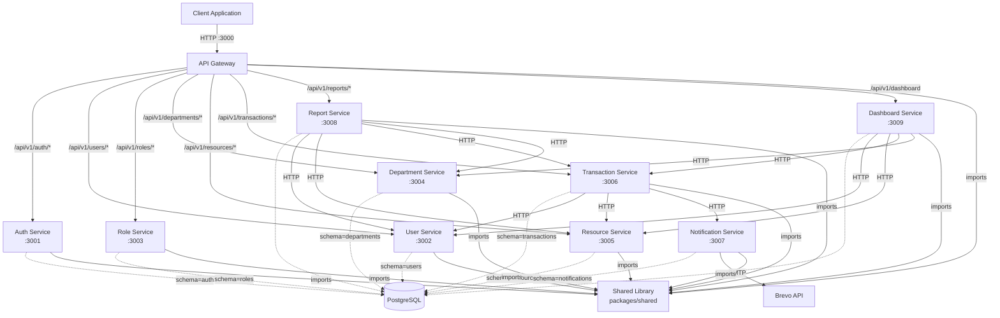

# Design Document

## Feature: Microservices Migration

---

## Overview

This document describes the technical design for migrating the Institution Management Starter Kit from a monolithic Node.js/TypeScript/Express application to a pure microservices architecture.

The existing monolith is a single process (`src/app.ts` + `src/server.ts`) that co-locates eight domain modules — auth, users, roles, departments, resources, transactions, reports, and dashboard — sharing one PostgreSQL database, one Prisma client, one middleware stack, and one Express router tree.

The target architecture decomposes the monolith into ten independently deployable services:

| Service | Port | Responsibility |
|---|---|---|
| `api-gateway` | 3000 (public) | Reverse-proxy; unified entry point; aggregated Swagger |
| `auth-service` | 3001 | Registration, login, JWT/refresh-token lifecycle, email verification, password reset |
| `user-service` | 3002 | CRUD management of user accounts |
| `role-service` | 3003 | CRUD management of roles |
| `department-service` | 3004 | CRUD management of departments |
| `resource-service` | 3005 | CRUD management of institutional resources |
| `transaction-service` | 3006 | Transaction creation, update, status-transition enforcement |
| `notification-service` | 3007 | Transactional email delivery via Brevo; notification persistence |
| `report-service` | 3008 | Aggregated cross-domain statistical reports |
| `dashboard-service` | 3009 | Cross-domain admin summary metrics |

Each service owns its own PostgreSQL schema namespace, its own Prisma schema, its own Dockerfile, and its own test suite. A shared npm workspace package (`packages/shared/`) provides common utilities, middleware, types, and Zod schemas consumed by all services.

All services communicate via HTTP over a Docker Compose network (`microservices-network`). JWT authentication is verified locally within each service using a shared `JWT_SECRET`, eliminating the need for a central auth gateway on every request. The API Gateway routes client requests by path prefix (`/api/v1/auth`, `/api/v1/users`, etc.) to the appropriate downstream service, forwarding the `Authorization` header unchanged.

This design preserves all existing API contracts, request/response formats, validation schemas, and role-based authorization rules. Clients continue to interact with a single public endpoint; the distributed nature of the system is transparent.

**Design Goals:**
- Independent deployability: Each service can be built, tested, scaled, and deployed without affecting others
- Fault isolation: Failure of one service does not crash the entire system
- Data ownership: Each service owns its schema namespace; no cross-service Prisma imports
- Backward compatibility: All existing API contracts, HTTP methods, paths, and Envelope response formats remain unchanged
- Operational simplicity: Single `docker compose up` command to run the entire system locally

---

## Architecture

### High-Level Architecture Diagram



### Architecture Characteristics

**Communication Pattern:** Synchronous HTTP/REST over Docker Compose network. No message queues or event streaming in this initial migration; all inter-service calls are blocking HTTP requests with explicit timeouts.

**Data Consistency:** Each service owns its schema namespace and is the authoritative source for its domain data. Cross-domain consistency is eventual; for example, if User_Service updates a user's email, Transaction_Service continues to reference the user by `userId` (UUID) and fetches fresh user details on-demand via HTTP.

**Service Discovery:** Docker Compose network DNS resolution. Each service can reach others by hostname (e.g., `http://user-service:3002`). Service URLs are injected via environment variables (`USER_SERVICE_URL`, `RESOURCE_SERVICE_URL`) and validated on startup.

**Authentication:** Distributed JWT verification. Auth_Service issues tokens signed with `JWT_SECRET`. Each service independently verifies tokens using the same secret, eliminating a central auth bottleneck.

**Failure Modes:**
- If Auth_Service is down, clients cannot log in or refresh tokens, but authenticated requests to other services succeed (JWT verified locally)
- If User_Service is down, Transaction_Service cannot validate `userId` during transaction creation, returning HTTP 502 to the client
- If Notification_Service is down, Transaction_Service logs the failure and still returns the transaction to the client (non-blocking notification pattern)
- If any service is down, Dashboard_Service returns a partial summary with a field indicating which services were unavailable (partial degradation)

---

## Components and Interfaces

### Component: API Gateway

The API Gateway is a thin reverse-proxy built with Express and `http-proxy-middleware`. It does not perform business logic or JWT verification — its sole responsibilities are request routing, error wrapping when downstream services fail, and serving the unified Swagger UI.

**Interface:**

```
GET  /health                → { success: true, data: { status: "ok" } }
ANY  /api/v1/auth/*         → proxy to AUTH_SERVICE_URL
ANY  /api/v1/users/*        → proxy to USER_SERVICE_URL
ANY  /api/v1/roles/*        → proxy to ROLE_SERVICE_URL
ANY  /api/v1/departments/*  → proxy to DEPARTMENT_SERVICE_URL
ANY  /api/v1/resources/*    → proxy to RESOURCE_SERVICE_URL
ANY  /api/v1/transactions/* → proxy to TRANSACTION_SERVICE_URL
ANY  /api/v1/reports/*      → proxy to REPORT_SERVICE_URL
ANY  /api/v1/dashboard*     → proxy to DASHBOARD_SERVICE_URL
GET  /api-docs              → Aggregated Swagger UI (aggregates /api-docs.json from each service)
*                           → HTTP 404 Envelope error
```

**Key Behaviors:**
- Forwards `Authorization` header unchanged on every proxied request
- Returns HTTP 503 Envelope error when a downstream service is unreachable or times out (30-second timeout)
- Returns HTTP 4xx/5xx from downstream services unchanged (passthrough error relay)
- Returns HTTP 404 Envelope error for unmatched routes
- On startup, aggregates Swagger specs from all services at `GET /api-docs.json`; logs `console.warn` for unavailable services but continues serving available specs

**Implementation Notes:**
- Use `http-proxy-middleware` v3 with `changeOrigin: true`
- Set `proxyTimeout: 30000` globally; request-specific timeouts enforced by downstream services
- A custom `on.error` callback translates proxy errors to HTTP 503 Envelope responses

### Component: Auth Service

Handles the full authentication lifecycle. It is the only service that writes to the `RefreshToken` table and the only one that calls Brevo directly for email verification and password reset flows.

**Endpoints (preserving existing contracts):**
```
POST /api/v1/auth/register         → creates user + sends welcome/verification email via Notification_Service
POST /api/v1/auth/verify-email     → verifies email token
POST /api/v1/auth/login            → returns access token + refresh token
POST /api/v1/auth/logout           → invalidates refresh token
POST /api/v1/auth/forgot-password  → sends password-reset email via Notification_Service
POST /api/v1/auth/reset-password   → validates reset token, updates password
POST /api/v1/auth/refresh-token    → rotates refresh token, issues new access token
GET  /health
GET  /api-docs
```

**JWT Payload Interface:**
```typescript
interface JwtPayload {
  userId: string;   // UUID
  email:  string;
  role:   string;   // role name
}
```

**Database Schema (namespace: `auth`):**
Models: `User` (id, email, password, roleId, isVerified, verificationToken, resetPasswordToken, resetPasswordExpiry, createdAt, updatedAt), `RefreshToken` (id, userId, token, expiresAt, createdAt), `Role` (read-only projection — id, name)

**Inter-Service Calls:**
- Calls `POST /api/v1/notifications/send` on Notification_Service to send verification, welcome, password-reset, and login emails (fire-and-forget pattern with 5-second timeout; failure is logged but does not block the auth response)

### Component: User Service

**Endpoints:**
```
GET    /api/v1/users        → paginated user list (Admin only)
POST   /api/v1/users        → create user (Admin only)
GET    /api/v1/users/:id    → get user by ID (Admin only)
PUT    /api/v1/users/:id    → update user (Admin only)
DELETE /api/v1/users/:id    → delete user (Admin only)
GET    /health
GET    /api-docs
```

**Database Schema (namespace: `users`):** Models: `User` (id, email, password, firstName, lastName, roleId, isVerified, createdAt, updatedAt), `Role` (read-only projection — id, name)

### Component: Role Service

**Endpoints:**
```
GET    /api/v1/roles        → list all roles (Admin only)
POST   /api/v1/roles        → create role (Admin only)
GET    /api/v1/roles/:id    → get role by ID (Admin only)
PUT    /api/v1/roles/:id    → update role (Admin only)
DELETE /api/v1/roles/:id    → delete role (Admin only)
GET    /health
GET    /api-docs
```

**Database Schema (namespace: `roles`):** Model: `Role` (id, name, description, createdAt, updatedAt)

### Component: Department Service

**Endpoints:**
```
GET    /api/v1/departments        → paginated departments (authenticated)
POST   /api/v1/departments        → create department (Admin only)
GET    /api/v1/departments/:id    → get department by ID (authenticated)
PUT    /api/v1/departments/:id    → update department (Admin only)
DELETE /api/v1/departments/:id    → delete department (Admin only)
GET    /health
GET    /api-docs
```

**Database Schema (namespace: `departments`):** Model: `Department` (id, name, description, createdAt, updatedAt)

### Component: Resource Service

**Endpoints:**
```
GET    /api/v1/resources        → paginated resources (authenticated)
POST   /api/v1/resources        → create resource (Admin only)
GET    /api/v1/resources/:id    → get resource by ID (authenticated)
PUT    /api/v1/resources/:id    → update resource (Admin only)
DELETE /api/v1/resources/:id    → delete resource (Admin only)
GET    /health
GET    /api-docs
```

**Database Schema (namespace: `resources`):** Model: `Resource` (id, name, description, departmentId, status, quantity, createdAt, updatedAt). Note: `departmentId` is a foreign-key-only field; no write migrations are permitted against the `departments` schema namespace.

### Component: Transaction Service

The most complex service. Validates referenced entities by calling User_Service and Resource_Service, enforces status-transition rules, and triggers notification emails.

**Endpoints:**
```
GET    /api/v1/transactions        → paginated transactions (authenticated)
POST   /api/v1/transactions        → create transaction (Admin or Staff)
GET    /api/v1/transactions/:id    → get transaction by ID (authenticated)
PUT    /api/v1/transactions/:id    → update/status-transition (Admin or Staff)
DELETE /api/v1/transactions/:id    → delete transaction (Admin only)
GET    /health
GET    /api-docs
```

**Status Transition Rules (must be preserved exactly):**
```
Pending  → Active
Active   → Completed | Cancelled
Completed → (terminal)
Cancelled → (terminal)
```

**Database Schema (namespace: `transactions`):** Model: `Transaction` (id, userId, resourceId, status, notes, startDate, endDate, createdAt, updatedAt)

**Inter-Service Calls (on POST):**
1. `GET /api/v1/users/:userId` on User_Service — timeout 5s — validates user exists; HTTP 422 if fails
2. `GET /api/v1/resources/:resourceId` on Resource_Service — timeout 5s — validates resource exists; HTTP 422 if fails
3. `POST /api/v1/notifications/send` on Notification_Service — timeout 3s — sends notification; failure logged, not blocking

### Component: Notification Service

**Endpoints:**
```
POST /api/v1/notifications/send   → sends a transactional email and persists a notification record
GET  /health
GET  /api-docs
```

**Database Schema (namespace: `notifications`):** Model: `Notification` (id, userId, type, subject, body, status, sentAt, createdAt, updatedAt)

**External Dependency:** Brevo SMTP API. Credentials (`BREVO_API_KEY`, `BREVO_SENDER_EMAIL`, `BREVO_SENDER_NAME`) injected via environment variables.

### Component: Report Service

**Endpoints:**
```
GET /api/v1/reports/users         → aggregated user statistics
GET /api/v1/reports/resources     → aggregated resource statistics
GET /api/v1/reports/transactions  → aggregated transaction statistics
GET /api/v1/reports/departments   → aggregated department statistics
GET /health
GET /api-docs
```

**Inter-Service Calls:** Calls User_Service, Resource_Service, Transaction_Service, and Department_Service with 5-second timeouts. Returns HTTP 503 if any required call fails.

### Component: Dashboard Service

**Endpoints:**
```
GET /api/v1/dashboard   → cross-domain admin summary (last 30 days)
GET /health
GET /api-docs
```

**Inter-Service Calls:** Calls User_Service, Resource_Service, Transaction_Service, and Department_Service with 5-second timeouts. Returns partial summary with `unavailableServices` field if any call fails.

### Component: Shared Library (`packages/shared/`)

A local npm workspace package consumed by all services. Contains no business logic — only utilities, types, and schemas.

**Exports:**
- `AppError` — custom error class extending `Error` with `statusCode` and optional `errors` array
- `sendSuccess(res, message, data, statusCode?)` — sends Envelope success response
- `sendError(res, message, statusCode?, errors?)` — sends Envelope error response
- `paginate(page, limit)` — computes `skip` and `take` for Prisma queries
- `buildPaginatedResult(data, total, page, limit)` — assembles paginated response shape
- `authenticate` — Express middleware: verifies Bearer JWT, attaches `req.user as JwtPayload`, returns 401 on failure
- `asyncHandler(fn)` — wraps async route handlers to forward errors to `next()`
- `uuidParamSchema` — Zod schema validating `:id` path params as UUID v4
- `paginationQuerySchema` — Zod schema validating `page` and `limit` query params
- `JwtPayload` — TypeScript interface `{ userId: string; email: string; role: string }`

---

## Data Models

### Auth Service (schema namespace: `auth`)

```prisma
model User {
  id                   String         @id @default(uuid())
  email                String         @unique
  password             String
  roleId               String
  isVerified           Boolean        @default(false)
  verificationToken    String?
  resetPasswordToken   String?
  resetPasswordExpiry  DateTime?
  createdAt            DateTime       @default(now())
  updatedAt            DateTime       @updatedAt
  refreshTokens        RefreshToken[]
  role                 Role           @relation(fields: [roleId], references: [id])
}

model RefreshToken {
  id        String   @id @default(uuid())
  userId    String
  token     String   @unique
  expiresAt DateTime
  createdAt DateTime @default(now())
  user      User     @relation(fields: [userId], references: [id], onDelete: Cascade)
}

model Role {
  id    String @id @default(uuid())
  name  String @unique
  users User[]
  @@map("roles")  // read-only projection; authoritative data lives in roles schema
}
```

### User Service (schema namespace: `users`)

```prisma
model User {
  id         String   @id @default(uuid())
  email      String   @unique
  password   String
  firstName  String
  lastName   String
  roleId     String
  isVerified Boolean  @default(false)
  createdAt  DateTime @default(now())
  updatedAt  DateTime @updatedAt
  role       Role     @relation(fields: [roleId], references: [id])
}

model Role {
  id    String @id @default(uuid())
  name  String @unique
  users User[]
}
```

### Role Service (schema namespace: `roles`)

```prisma
model Role {
  id          String   @id @default(uuid())
  name        String   @unique
  description String?
  createdAt   DateTime @default(now())
  updatedAt   DateTime @updatedAt
}
```

### Department Service (schema namespace: `departments`)

```prisma
model Department {
  id          String   @id @default(uuid())
  name        String   @unique
  description String?
  createdAt   DateTime @default(now())
  updatedAt   DateTime @updatedAt
}
```

### Resource Service (schema namespace: `resources`)

```prisma
model Resource {
  id           String   @id @default(uuid())
  name         String
  description  String?
  departmentId String   // foreign key only; no relation enforced across schema namespaces
  status       String
  quantity     Int      @default(0)
  createdAt    DateTime @default(now())
  updatedAt    DateTime @updatedAt
}
```

### Transaction Service (schema namespace: `transactions`)

```prisma
enum TransactionStatus {
  Pending
  Active
  Completed
  Cancelled
}

model Transaction {
  id         String            @id @default(uuid())
  userId     String
  resourceId String
  status     TransactionStatus @default(Pending)
  notes      String?
  startDate  DateTime?
  endDate    DateTime?
  createdAt  DateTime          @default(now())
  updatedAt  DateTime          @updatedAt
}
```

### Notification Service (schema namespace: `notifications`)

```prisma
model Notification {
  id        String   @id @default(uuid())
  userId    String?
  type      String
  subject   String
  body      String
  status    String   @default("pending")
  sentAt    DateTime?
  createdAt DateTime @default(now())
  updatedAt DateTime @updatedAt
}
```

### Shared Types (packages/shared)

```typescript
interface JwtPayload {
  userId: string;
  email:  string;
  role:   string;
}

interface Envelope<T = unknown> {
  success: boolean;
  message: string;
  data:    T;
}

interface PaginatedEnvelope<T = unknown> extends Envelope<T[]> {
  page:       number;
  limit:      number;
  total:      number;
  totalPages: number;
}
```

---

## Error Handling

### Envelope Error Format

All services return errors in the standard Envelope format:

```json
{ "success": false, "message": "<human-readable message>", "data": null }
```

For validation errors, an `errors` array is included:

```json
{ "success": false, "message": "Validation failed", "errors": [{ "field": "email", "message": "Invalid email" }] }
```

### HTTP Status Code Mapping

| Scenario | Status Code | Source |
|---|---|---|
| Missing or malformed Bearer token | 401 | Any service `authenticate` middleware |
| Expired or invalid JWT signature | 401 | Any service `authenticate` middleware |
| Insufficient role | 403 | Any service `authorise` middleware |
| Request body/param validation failure | 400 | Any service Zod validation middleware |
| Resource not found | 404 | Any service controller |
| Invalid transaction status transition | 422 | Transaction Service |
| Cross-service validation failure (user/resource not found) | 422 | Transaction Service |
| Inter-service call network failure | 502 | Calling service |
| Downstream service unavailable (gateway) | 503 | API Gateway |
| No matching route (gateway) | 404 | API Gateway |
| Unhandled server error | 500 | Any service `errorHandler` middleware |

### Error Handler Middleware

Each service mounts an Express `errorHandler` middleware as the last middleware in the chain. It:

1. Catches all errors passed to `next(err)` or thrown from `asyncHandler`-wrapped routes
2. Logs `[service-name] ERROR <method> <path>: <message>\n<stack>` via `console.error`
3. Returns the appropriate Envelope error response based on `AppError.statusCode` (default: 500)

### Inter-Service Call Failure Handling

| Caller | Target | Timeout | Failure Behavior |
|---|---|---|---|
| Auth Service | Notification Service | 5s | Log warning; return auth response normally |
| Transaction Service | User Service | 5s | Return HTTP 422 with descriptive message |
| Transaction Service | Resource Service | 5s | Return HTTP 422 with descriptive message |
| Transaction Service | Notification Service | 3s | Log warning; return transaction response normally |
| Dashboard Service | Any downstream | 5s | Return partial summary with `unavailableServices` field |
| Report Service | Any downstream | 5s | Return HTTP 503 with descriptive message |

### Startup Validation Failures

If Zod environment validation fails on startup, each service:
1. Logs `[service-name] Configuration error: <field>: <issue>` per failing variable
2. Exits with process code 1 before binding to any port

---

## Correctness Properties

### Property 1: Transaction Status Transitions Are Strictly Enforced

**Validates: Requirements 9.10, 6.2**

### Transaction Status Machine

The transaction status must follow strict transition rules. These are invariants enforced by the Transaction Service business logic:

- A `Pending` transaction may only transition to `Active`
- An `Active` transaction may only transition to `Completed` or `Cancelled`
- `Completed` and `Cancelled` are terminal states; no further transitions are permitted
- Any PUT request attempting a disallowed transition returns HTTP 422

### JWT Token Integrity

- All JWT access tokens are signed with `JWT_SECRET` (minimum 32 characters)
- Every service independently verifies the token signature and expiry; no service trusts a decoded payload passed in headers
- `req.user` is only populated after successful local verification
- Refresh token rotation: the prior token is invalidated before a new one is issued, preventing token reuse

### Data Ownership Boundaries

- No microservice imports the Prisma client of another service
- Cross-schema foreign keys (e.g., `Resource.departmentId`) are stored as plain UUID strings with no enforced relational constraint across schema namespaces
- All cross-domain data retrieval is performed via inter-service HTTP calls

### Idempotency

- The seed script is idempotent: re-running it will not create duplicate admin users or roles (uses upsert semantics)
- Prisma migrations are applied via `prisma migrate deploy`, which is idempotent for already-applied migrations

### Pagination Correctness

- `page` must be ≥ 1; `limit` must be between 1 and 100
- `totalPages = Math.ceil(total / limit)`
- `skip = (page - 1) * limit`
- All paginated endpoints return `{ page, limit, total, totalPages }` alongside the data array

---

## Testing Strategy

### Unit Tests (per service)

Each microservice has a `tests/` directory with unit tests covering the service layer. All external dependencies (Prisma client, other services via HTTP, Brevo API) are mocked using Jest mocks.

**Key test files:**
- `services/auth-service/tests/auth.service.unit.test.ts` — migrated from `src/modules/auth/tests/auth.service.unit.test.ts`
- `services/notification-service/tests/emailTemplates.test.ts` — migrated from `src/modules/notifications/templates/emailTemplates.test.ts`
- `packages/shared/tests/pagination.test.ts` — property-based tests using `fast-check`, migrated from `src/utils/pagination.test.ts`

### Property-Based Tests (Shared Library)

The `packages/shared/` pagination utilities are tested with property-based tests using `fast-check`:
- For any valid `(page ≥ 1, limit ≥ 1, total ≥ 0)`: `buildPaginatedResult` always returns `totalPages = Math.ceil(total / limit)`
- For any valid inputs: `page` and `limit` in the result always match the inputs
- For any valid inputs: `data.length ≤ limit`

### Test Isolation

- Each microservice test suite runs independently with `npm test` inside its directory
- No test requires network access, a running database, or another service to be up
- Jest `moduleNameMapper` or manual mocks are used to stub `@prisma/client` and `axios`/`node-fetch`

### Running All Tests

The root `package.json` provides a `test:all` script that runs each service's test suite in sequence. If any suite exits with a non-zero code, `test:all` exits non-zero and reports the failing service name.

### Health Check Verification

Integration-level health check verification is performed by running `docker compose up` and waiting for all `/health` endpoints to return HTTP 200 within 120 seconds. This is not part of the unit test suite and is performed manually or in CI.
