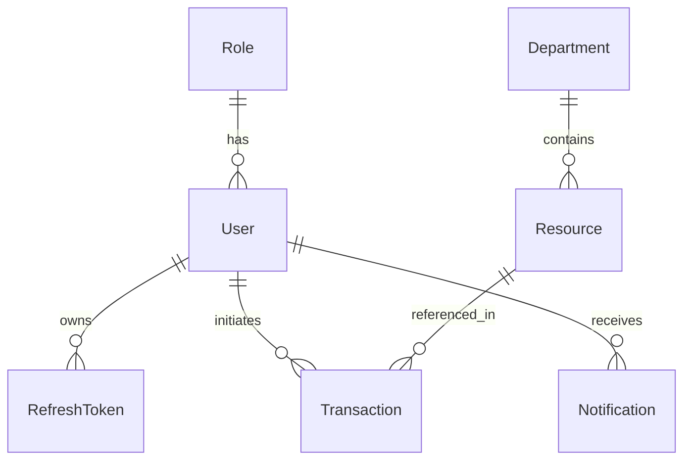

# Entity Relationship Diagram

```mermaid
erDiagram
    Role ||--o{ User : has
    User ||--o{ RefreshToken : owns
    User ||--o{ Transaction : initiates
    User ||--o{ Notification : receives
    Department ||--o{ Resource : contains
    Resource ||--o{ Transaction : referenced_in
```

See `prisma/schema.prisma` for full field definitions.
